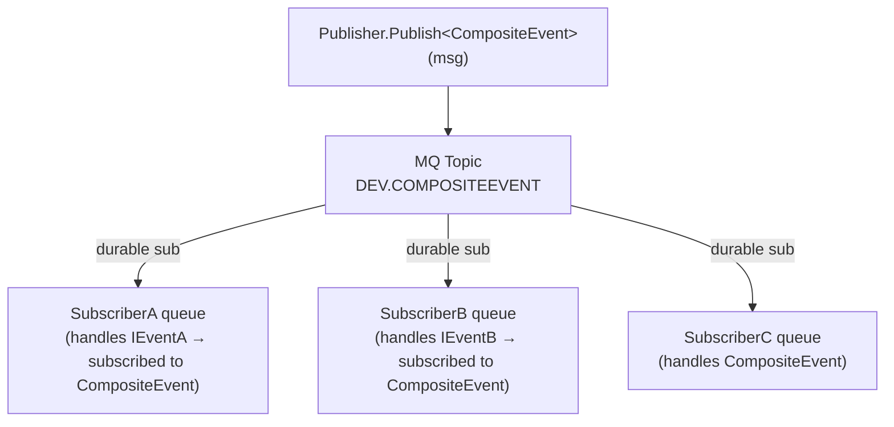
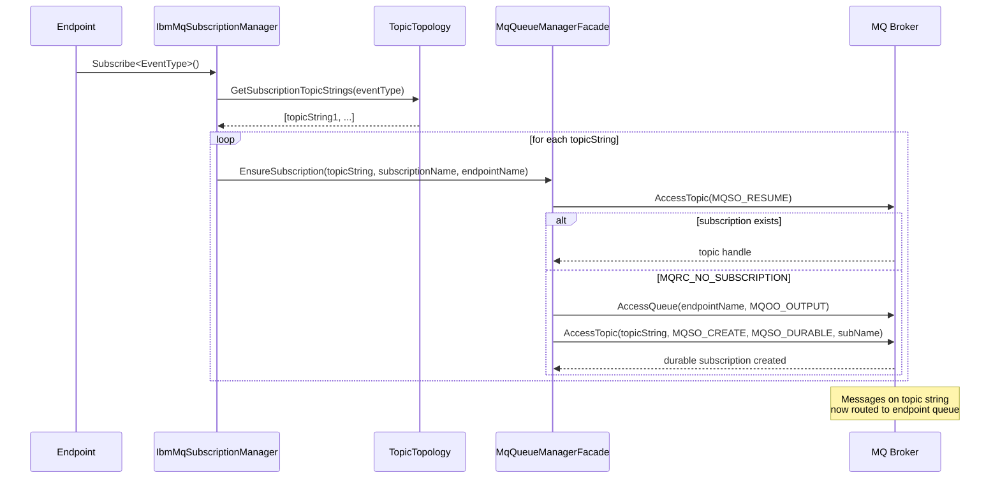
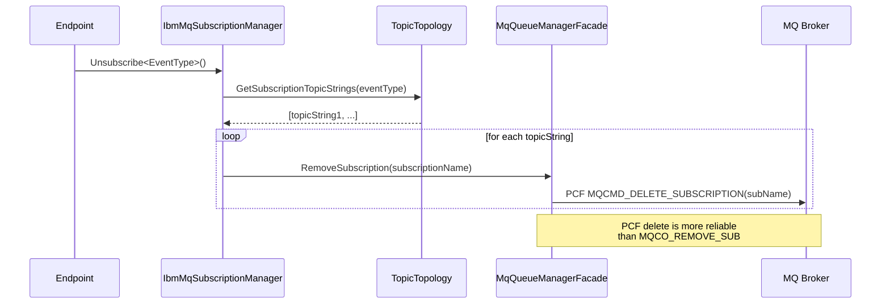

# Pub/Sub Routing Topology

## How It Works

The IBM MQ transport uses **MQ Topics** and **durable subscriptions** for pub/sub. Each concrete event type gets its own topic. Polymorphism is handled via **subscriber-side fan-out** — subscribing to a base class or interface automatically subscribes to all concrete descendants found in loaded assemblies.

| Aspect | Detail |
|--------|--------|
| **Publish** | 1 MQPUT to the concrete type's topic |
| **Subscribe** | N subscriptions — one per concrete type assignable to the subscribed type |
| **Polymorphism** | Full (classes + interfaces) via subscriber-side fan-out |
| **Duplicate risk** | None |

## Topic Naming

| Type | Topic Object (admin name, max 48 chars) | Topic String (for subscriptions) |
|------|----------------------------------------|----------------------------------|
| `CompositeEvent` | `DEV.NS.COMPOSITEEVENT` (uppercase, `+`->`.`) | `dev/ns.compositeevent/` (lowercase, `+`->`/`) |
| `IEventA` | `DEV.NS.IEVENTA` | `dev/ns.ieventa/` |
| `IEventB` | `DEV.NS.IEVENTB` | `dev/ns.ieventb/` |

Names exceeding 48 chars cause an `InvalidOperationException` by default. Override `TopicNaming.GenerateTopicName` in a custom subclass to implement a shortening strategy.

## Example: Polymorphic Events

```csharp
interface IEventA : IEvent { }
interface IEventB : IEvent { }
class CompositeEvent : IEventA, IEventB { }
```

### Publisher Side

When an endpoint publishes `CompositeEvent`, the dispatcher sends a single message to the concrete type's topic.

### Subscriber Side

A subscriber handling `IEventA` gets subscriptions to all concrete types assignable to `IEventA` (in this case `CompositeEvent`). Each subscriber receives the message exactly once.



All three subscribers receive the same message via the single concrete topic.

## Subscription Lifecycle



## Unsubscribe



## Unicast vs Multicast

| Operation | MQ Mechanism | Routing |
|-----------|-------------|---------|
| `Send` / `Reply` | Direct queue put | Sender specifies destination queue name |
| `Publish` | Topic put (single concrete type topic) | MQ broker fans out via durable subscriptions to subscriber queues |
| `Subscribe` | Durable subscription (MQSO_CREATE) | Links topic string to endpoint's input queue |
| `Unsubscribe` | PCF MQCMD_DELETE_SUBSCRIPTION | Removes the durable subscription |

## Subscription Name Format

| Component | Format | Example |
|-----------|--------|---------|
| Subscription name | `{endpointName}:{topicString}` | `MyEndpoint:dev/ns.myevent/` |
