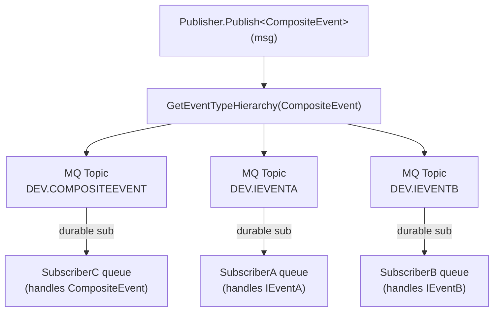
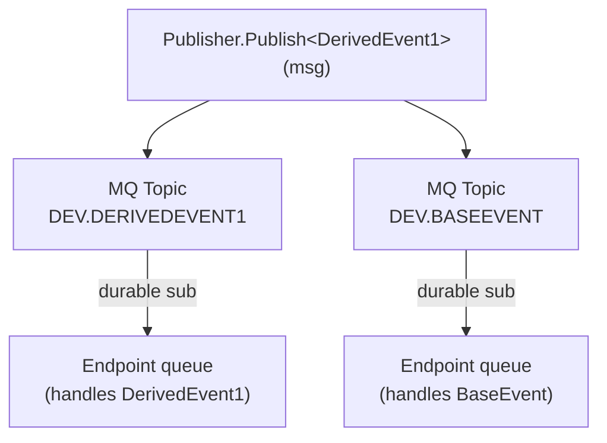
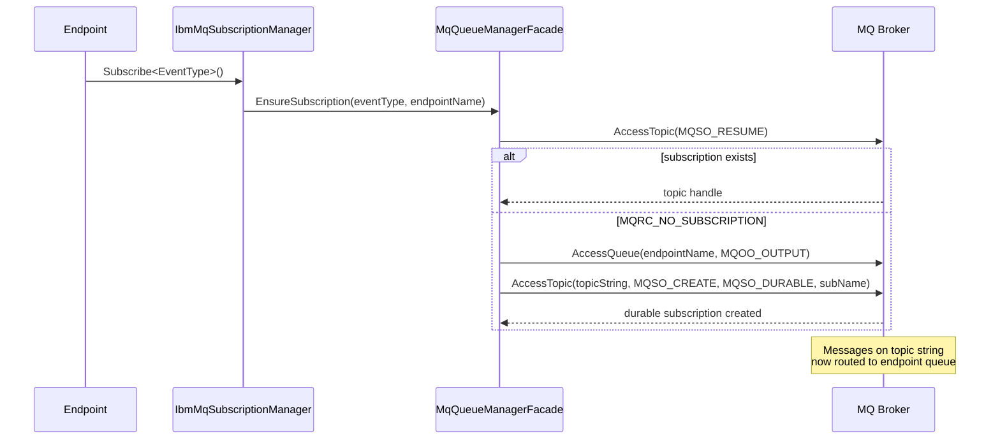
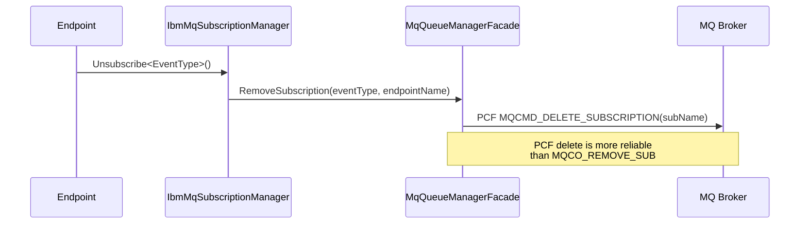
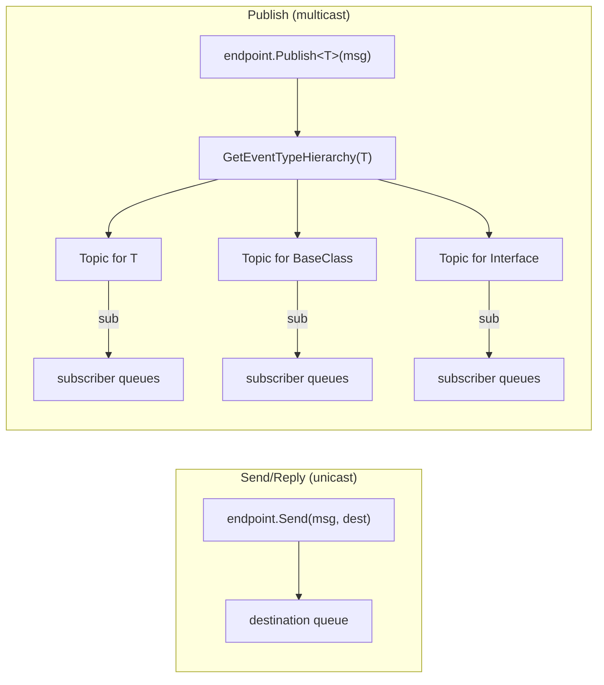

# Pub/Sub Routing Topology

## How It Works

The IBM MQ transport uses **MQ Topics** and **durable subscriptions** for pub/sub. The **publisher** publishes to ALL types in the event hierarchy, and **subscribers** create durable subscriptions to the specific types they care about.

## Example: CompositeEvent

From the NServiceBus acceptance test `When_publishing_an_event_implementing_two_unrelated_interfaces`:

```csharp
interface IEventA : IEvent { }
interface IEventB : IEvent { }
class CompositeEvent : IEventA, IEventB { }
```

### Publisher Side

When an endpoint publishes `CompositeEvent`, the dispatcher calls `GetEventTypeHierarchy(typeof(CompositeEvent))` which yields:

| Type | Why included | Excluded? |
|------|-------------|-----------|
| `CompositeEvent` | Concrete type (always first) | No |
| `IEventA` | Implemented interface | No |
| `IEventB` | Implemented interface | No |
| `IEvent` | NServiceBus marker interface | **Yes** |
| `IMessage` | NServiceBus marker interface | **Yes** |

For EACH included type, the dispatcher ensures a topic exists and publishes the message to it.

### Topic Naming

| Type | Topic Object (admin name, max 48 chars) | Topic String (for subscriptions) |
|------|----------------------------------------|----------------------------------|
| `CompositeEvent` | `DEV.NS.COMPOSITEEVENT` (uppercase, `+`→`.`) | `dev/ns.compositeevent/` (lowercase, `+`→`/`) |
| `IEventA` | `DEV.NS.IEVENTA` | `dev/ns.ieventa/` |
| `IEventB` | `DEV.NS.IEVENTB` | `dev/ns.ieventb/` |

Names exceeding 48 chars are hash-truncated: `DEV.FIRST39CHARS_8CHARHEX`. Subscription names exceeding 256 chars use 16-char hashes.

### Full Message Flow



All three subscribers receive the same message, each via a different topic matching their subscription type.

## Example: Class Hierarchy

From the acceptance test `When_base_event_from_2_publishers`:

```csharp
class BaseEvent : IEvent { }
class DerivedEvent1 : BaseEvent { }
```



A subscriber handling `BaseEvent` receives ALL derived events because the publisher publishes to `BaseEvent`'s topic for every derived type.

## Subscription Lifecycle



## Unsubscribe



## Unicast vs Multicast



| Operation | MQ Mechanism | Routing |
|-----------|-------------|---------|
| `Send` / `Reply` | Direct queue put | Sender specifies destination queue name |
| `Publish` | Topic put (one per type in hierarchy) | MQ broker fans out via durable subscriptions to subscriber queues |
| `Subscribe` | Durable subscription (MQSO_CREATE) | Links topic string to endpoint's input queue |
| `Unsubscribe` | PCF MQCMD_DELETE_SUBSCRIPTION | Removes the durable subscription |

## Subscription Name Format

| Component | Format | Example |
|-----------|--------|---------|
| Subscription name | `{endpointName}:{topicString}` | `MyEndpoint:dev/ns.myevent/` |
| If > 256 chars | `{first239chars}_{16charSHA256hex}` | `AAAA...AAA:dev/ns.myev_3F2A1B9C0D4E5F67` |
